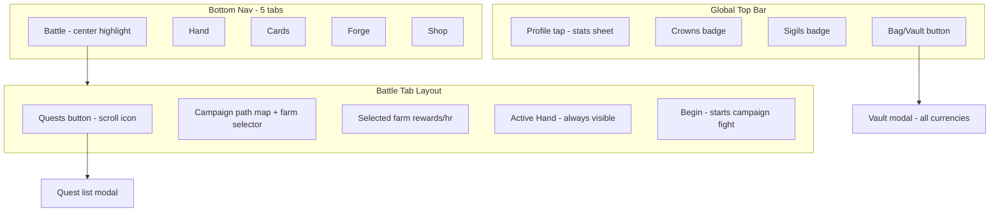

# Cardborn Heroes — Full Rebuild Plan

Save this document externally before deleting the repo. After rebuild, place it at `docs/REBUILD_PLAN.md` in the new monorepo.

---

## 1. Core game identity

**Elevator pitch:** Cardborn Heroes is a dual-platform hero card collector with AFK idle farming, campaign auto-battles, Ascendant pack openings, and Forge crafting. Players build **Hands** (5 slots: heroes + gear), pick an **active Hand** for combat and idle rewards, and climb tiers from **Basic** to **Cardborn**.

**Design pillars to preserve:**
- **Gilded Ivory** UI — cream/gold/charcoal (exact hex below)
- **Battle overlay** — staggered ally/enemy layout (port from current [`BattleScreen.kt`](c:/Users/colan/Desktop/SkyTown Studios/cardborn-heroes/android/app/src/main/java/com/skytownstudios/cardbornheroes/ui/screens/BattleScreen.kt))
- **Ascendant Pack** economy — exact tier stats + drop tables (Section 5)
- **Shared content monorepo** — one source of truth, sync to both platforms

**Not a kids/edu app.** Do not use `kids-app-pipeline`. Scaffold manually with `shared/` + `android/` + `ios/`.

---

## 2. Visual identity — Gilded Ivory (locked)

| Token | Hex | Usage |
|-------|-----|-------|
| Background cream | `#F5F0E6` | App background |
| Deep cream | `#EDE6D8` | Panels, gradients |
| Surface white | `#FFFFFF` | Cards, sheets |
| Primary gold | `#D4AF37` | Buttons, selected nav, accents |
| Bronze outline | `#B08D57` | Borders, muted accents, gems badge replacement |
| Text charcoal | `#3B2F2F` | Primary text, nav bar |
| Text muted | `#8B7355` | Secondary text |

**Battle arena gradient (keep):** `#D4C4A8` → `#B8A078` → `#9A8468`  
**Battle top bar:** `#3B2F2F` at 72% alpha on cream text

**Art direction for regeneration:** Same cartoony card-game style as today, but **re-tinted and re-lit for Gilded Ivory** — warm cream highlights, gold rim lighting, charcoal outlines (not cool teal/green). Heroes and gear card art must be **fully regenerated**; battle scene layout stays, arena background may get subtle ivory/gold wash.

---

## 3. Currency & inventory naming (locked)

| Old | New display | Code field | Asset file |
|-----|-------------|------------|------------|
| Gold | **Crowns** | `crowns` | `assets/ui/currency_crowns.png` |
| Gems | **Sigils** | `sigils` | `assets/ui/currency_sigils.png` |
| Materials | Hero Essence, Steel Scrap, Arcane Dust | `materials` map | per-material icons |
| Sealed packs | Ascendant Packs (by tier) | `packInventory` map | `assets/ui/pack_ascendant_{tier}.png` |
| Crafting scraps | (same material IDs) | `materials` | reuse material icons |

**Vault / Bag** (top-bar button, not a tab): scrollable inventory of Crowns, Sigils, all materials, sealed packs, and quick counts. Accessible from every screen via top bar.

---

## 4. Card stats — exact numbers (copy into `shared/content/`)

### 4.1 Tier multipliers (`generate_tier_content.py`)

```
basic=1.0, common=1.15, uncommon=1.32, rare=1.52, epic=1.75, mythic=2.0, cardborn=2.35
formula: max(1, int(baseStat * multiplier))
```

### 4.2 Hero base stats (Basic tier)

| Role | ID suffix | HP | ATK | DEF |
|------|-----------|-----|-----|-----|
| Knight (tank) | `knight` | 1200 | 85 | 60 |
| Archer (ranger) | `archer` | 750 | 110 | 35 |
| Mage (caster) | `mage` | 680 | 130 | 25 |

**Knight by tier:** basic 1200/85/60 → common 1380/97/69 → uncommon 1584/112/79 → rare 1824/129/91 → epic 2100/148/105 → mythic 2400/170/120 → cardborn 2820/199/141

**Archer by tier:** 750/110/35 → 862/126/40 → 990/145/46 → 1140/167/53 → 1312/192/61 → 1500/220/70 → 1762/258/82

**Mage by tier:** 680/130/25 → 781/149/28 → 897/171/33 → 1033/197/38 → 1190/227/43 → 1360/260/50 → 1598/305/58

**IDs:** `hero_{role}_{tier}` except basic omits tier: `hero_knight`, `hero_archer`, `hero_mage`, then `hero_knight_common`, etc.

### 4.3 Gear base bonuses (Basic tier, all weapons)

| Gear | ATK | HP | DEF | Roles |
|------|-----|-----|-----|-------|
| Sword | 25 | 1 | 10 | tank, ranger |
| Bow | 35 | 50 | 1 | ranger |
| Staff | 40 | 30 | 1 | caster |

Scale bonuses with same tier multipliers. Cardborn Sword: 58/1/23. Cardborn Bow: 82/117/1. Cardborn Staff: 94/70/1.

**IDs:** `gear_{type}_{tier}` (basic omits tier suffix).

### 4.4 Materials & recipes

**Materials:** `mat_hero_essence`, `mat_steel`, `mat_arcane_dust`

**Recipes (6, basic only for v1):**

| Recipe | Output | Cost |
|--------|--------|------|
| Craft Basic Knight | `hero_knight` | 10 essence + 5 steel |
| Craft Basic Archer | `hero_archer` | 10 essence + 3 steel |
| Craft Basic Mage | `hero_mage` | 10 essence + 8 arcane dust |
| Craft Basic Sword | `gear_sword` | 8 steel |
| Craft Basic Bow | `gear_bow` | 6 steel |
| Craft Basic Staff | `gear_staff` | 10 arcane dust |

### 4.5 Hand rules

- **3 saved Hands** (`hands[0..2]`, `activeHandIndex`)
- **5 slots each** — mix of heroes and gear (same as today)
- **Hand Power** = sum of hero stats + gear bonuses (existing formula)
- **Active Hand** drives: campaign fights, AFK farm reward scaling, bottom Battle preview

**Farm scaling formula:**
```
effectiveCrownsPerHour = baseCrownsPerHour * (activeHandPower / 500)
effectiveDropRateMult = activeHandPower / 500  // apply to material/gear/hero/pack rolls
```
Clamp multiplier to `[0.5, 3.0]` so weak/strong hands stay bounded.

---

## 5. Ascendant Pack system (locked)

**Pack line name:** Ascendant (`packLine: "ascendant"`)  
**Purchasable tiers:** basic → mythic. **Cardborn** is drop-only.

### Pack costs

| ID | Name | Currency | Cost |
|----|------|----------|------|
| `ascendant_basic` | Basic Ascendant Pack | Crowns | 500 |
| `ascendant_common` | Common Ascendant Pack | Crowns | 1200 |
| `ascendant_uncommon` | Uncommon Ascendant Pack | Crowns | 2500 |
| `ascendant_rare` | Rare Ascendant Pack | Sigils | 150 |
| `ascendant_epic` | Epic Ascendant Pack | Sigils | 350 |
| `ascendant_mythic` | Mythic Ascendant Pack | Sigils | 750 |

### Structure (9 cards)

- **Slots 1–8:** 3 heroes + 3 gear + 2 materials (shuffled per open)
- **Slot 9:** Guaranteed hero **or** gear (50/50); never material

**Slot type odds (1–8):** Hero 37.5%, Equipment 37.5%, Material 25%

### Tier roll — slots 1–8

Own-tier target rates (`TOP_TIER_SLOT_RATE`):
`[1.0, 0.25, 0.12, 0.09, 0.07, 0.06]` for basic→mythic

Lower tiers split remainder with weight `4^(packIndex - tierIndex)`.

| Pack | Basic | Common | Uncommon | Rare | Epic | Mythic |
|------|-------|--------|----------|------|------|--------|
| Basic | 100% | — | — | — | — | — |
| Common | 75.0% | 25.0% | — | — | — | — |
| Uncommon | 70.4% | 17.6% | 12.0% | — | — | — |
| Rare | 69.3% | 17.3% | 4.3% | 9.0% | — | — |
| Epic | 70.0% | 17.5% | 4.4% | 1.1% | 7.0% | — |
| Mythic | 70.6% | 17.6% | 4.4% | 1.1% | 0.3% | **6.0%** |

Material qty in packs: `3 × tier rank` (basic=3 … mythic=18). Cardborn never in slots 1–8.

### Slot 9 — guaranteed + upgrade

`GUARANTEED_UPGRADE_CHANCE = [0.40, 0.28, 0.20, 0.14, 0.08, 0.025]`

| Pack | Guaranteed | Upgrade → |
|------|------------|-------------|
| Basic | 60% basic | 40% common |
| Common | 72% common | 28% uncommon |
| Uncommon | 80% uncommon | 20% rare |
| Rare | 86% rare | 14% epic |
| Epic | 92% epic | 8% mythic |
| Mythic | 97.5% mythic | **2.5% cardborn** |

**Document in repo:** `docs/ascendant-packs.md` (copy verbatim from current repo before delete).

**Code constants:** `PackGenerator.kt` — port logic exactly; rename currency checks to `crowns`/`sigils`.

---

## 6. Navigation & screen architecture (locked)



### Tab responsibilities

| Tab | Purpose |
|-----|---------|
| **Battle** | AFK hub: campaign map, farm area picker, quests button, Begin, **active Hand preview always at bottom** (like AFK Arena screenshot) |
| **Hand** | Build/edit 3 Hands, pick active Hand, drag/tap 5 slots, power display |
| **Cards** | Owned heroes/gear grid + **Lexicon** sub-tab (all cards, recipes known/unknown) |
| **Forge** | Crafting with **recipe images**, material costs, craft button |
| **Shop** | Buy Ascendant packs, Open Packs flow, Premium IAP |

**Removed from bottom nav:** Quests (→ Battle modal), Deck/Lexicon/Armory split (→ Cards + Forge), Play label (→ Battle).

---

## 7. Battle tab — AFK Arena layout spec

**Top bar (all screens):**
- Left: avatar + player name + level placeholder + **total active Hand power**
- Right: Crowns, Sigils, Bag icon
- Profile tap → **Profile Sheet**: total Hand power, campaign stage, cards owned, packs opened, win rate, total Crowns earned, crafts completed, quests done. **Future:** damage types per Hand (stub section "Coming soon").

**Battle tab body (top → bottom):**
1. **Side quest button** (right edge, scroll icon) → full-screen quest list modal (claim rewards → sealed packs to inventory)
2. **Campaign path map** — winding path, nodes for stages, current stage highlighted (start with 3 nodes: Whispering Woods 1–3)
3. **Farm area selector** — horizontal chips or map pins; one selected by default (`goblin_hills`)
4. **Reward preview** — Crowns/hr + material/gear/hero/pack drop summary for selected farm
5. **Hand preview strip** — 5 slot mini portraits of **active Hand** (always visible)
6. **Begin button** — large center CTA; starts campaign fight for current stage using active Hand

**Campaign stages (v1):**

| Stage | Name | Rec. Power | Crowns reward |
|-------|------|------------|---------------|
| stage_1 | Whispering Woods 1 | 200 | 100 |
| stage_2 | Whispering Woods 2 | 350 | 150 |
| stage_3 | Whispering Woods 3 | 500 | 200 |

---

## 8. Farm areas — rewards (v1)

Each farm: base Crowns/hr + weighted idle drops (tick every 60s while app open; persist `lastFarmTick` for offline cap e.g. 8 hours).

| Farm ID | Name | Base Crowns/hr | Primary drops | Secondary drops | Rare pack drop |
|---------|------|----------------|---------------|-----------------|----------------|
| `goblin_hills` | Goblin Hills | 120 | Steel Scrap 2/hr | basic gear 0.5%/hr | ascendant_basic 0.02%/hr |
| `arcane_ruins` | Arcane Ruins | 80 | Arcane Dust 3/hr | basic hero 0.3%/hr | ascendant_common 0.01%/hr |
| `heroes_rest` | Hero's Rest | 60 | Hero Essence 2/hr | common gear 0.2%/hr | ascendant_uncommon 0.008%/hr |
| `cardborn_vault` | Cardborn Vault | 40 | mixed mats 1/hr each | uncommon hero 0.1%/hr | ascendant_rare 0.005%/hr |

All drop rates multiplied by **active Hand power scaling** (Section 4.5). Gear/hero drops grant lowest tier matching farm tier cap.

---

## 9. Battle overlay — preserve exactly

Port from current implementation:

- **Ally slots** (fractional x/y): `(0.06,0.04), (0.14,0.30), (0.06,0.58), (0.28,0.12), (0.28,0.46)`
- **Enemy slots** mirrored on right
- Circular fighter art, HP bar, name
- Auto-advance every **750ms**
- Top: stage name + combat log on charcoal bar
- Bottom: Victory (+Crowns) / Defeat + Continue

Only change: reward label "Crowns" instead of "Gold".

---

## 10. Cards tab spec

**Sub-tabs:** `Owned` | `Lexicon`

- **Owned:** filter Heroes / Gear / All; grid with regenerated card art; tap → detail sheet (stats, tier badge, equip-to-Hand shortcut)
- **Lexicon:** full catalog; undiscovered entries silhoutted; discovered show art + stats; link to Forge recipe if craftable

---

## 11. Forge tab spec

- Recipe list as **visual cards** (output hero/gear image prominent)
- Material cost row with **icons + owned/required counts**
- Craft button disabled until affordable
- Success animation + add to inventory
- Tier-colored borders matching Gilded Ivory palette

---

## 12. Shop tab spec

**Sub-tabs:** Buy | Open Packs | Premium

- Buy: Ascendant packs with **odds summary** from `AscendantPackOdds`
- Open Packs: 9-card reveal, skip to guaranteed #9, material cards with qty
- Premium: remove ads, monthly/yearly (from `shared/config/app.json`)

---

## 13. Monorepo scaffold (rebuild from scratch)

```
cardborn-heroes/
  shared/
    config/app.json          # IDs, IAP, AdMob, legal
    content/                 # heroes, gear, materials, recipes, packs, quests, campaigns, farms.json
    assets/
      cards/                 # hero + gear art (regenerated)
      ui/                    # currency, tabs, packs, materials
      battle/                # optional arena layers
    scripts/
      generate_tier_content.py
      sync.py
  docs/
    REBUILD_PLAN.md          # this file
    ascendant-packs.md
    ART_PROMPTS.md           # all AI prompts
  android/                   # Kotlin Compose
  ios/                       # SwiftUI (parity each phase)
  .github/workflows/dual-platform-build.yml
```

**Sync rule:** Edit only `shared/content` and `shared/assets`; run `python shared/scripts/sync.py` before platform builds.

**App IDs (keep):** `com.skytownstudios.cardbornheroes`

---

## 14. AI art regeneration — asset checklist + prompts

Create `docs/ART_PROMPTS.md` with every asset below. **Global style suffix for all prompts:**

> "Cartoony mobile card-game art, warm Gilded Ivory palette, cream and gold highlights, charcoal outlines, soft shading, no teal, transparent or cream background, 512x512, game asset"

### 14.1 Hero cards (21) — REGENERATE ALL

For each role × tier, prompt pattern:

> "Chibi [Knight|Archer|Mage] hero portrait card art, [tier] rarity feel, gold rim border glow, cream background, front-facing heroic pose, Cardborn Heroes style"

Files: `shared/assets/cards/{knight,archer,mage}.png` for basic; `{role}_{tier}.png` for others. Reuse same battle art paths `{role}_battle.png` or generate matching battle sprites.

### 14.2 Gear cards (21) — REGENERATE ALL

> "Cartoony [Sword|Bow|Staff] weapon icon card art, [tier] rarity gold accents, ivory background, centered item, RPG equipment card"

### 14.3 Currency & UI icons (NEW)

| Asset | Prompt sketch |
|-------|---------------|
| `currency_crowns.png` | Golden crown coin stack, cream glow |
| `currency_sigils.png` | Glowing gold sigil crystal, magical |
| `mat_hero_essence.png` | swirling golden essence vial |
| `mat_steel.png` | steel ingot/scrap with bronze tint |
| `mat_arcane_dust.png` | purple-gold arcane powder jar (keep readable on cream) |
| `pack_ascendant_{tier}.png` | Sealed pack envelope, tier-colored gold intensity |
| Tab icons ×5 | Battle sword/map, Hand gauntlet, Cards stack, Forge hammer, Shop bag |
| `icon_quests.png` | Scroll with gold seal |
| `icon_bag.png` | Ornate inventory bag |
| `profile_frame.png` | Gold oval portrait frame |

### 14.4 Battle tab map assets (NEW)

- `map_whispering_woods.png` — winding path background, ivory/gold fantasy map
- Node icons: locked, current, cleared
- Farm pin icons ×4

### 14.5 Forge & Shop

- Recipe card frame template
- Pack opening card back
- Empty slot silhouette for Hand builder

**Do not regenerate:** battle stagger layout logic; optionally light-touch arena gradient only.

---

## 15. Data models (shared → both platforms)

Key `PlayerState` fields:

```kotlin
crowns: Int
sigils: Int
materials: Map<String, Int>
packInventory: Map<String, Int>
heroCounts / gearCounts: Map<String, Int>
hands: List<Hand>           // 3 hands, 5 slots each
activeHandIndex: Int
campaignStageIndex: Int
activeFarmId: String
lastFarmTickEpochMs: Long
questProgress: Map<String, Int>
discoveredHeroes/Gear/Recipes: Set<String>
stats: PlayerLifetimeStats  // wins, losses, crownsEarned, packsOpened, craftsDone
```

Rename all `gold`/`gems` references in content JSON: pack `"currency": "crowns"` | `"sigils"`.

---

## 16. Build phases — iOS + Android parity each phase

Both platforms ship the same scope at end of each phase. Run sync + CI build on Mac/Windows.

### Phase 0 — Foundation (Week 1)
- Create monorepo structure, `app.json`, git, dual-platform CI
- Port `sync.py`, `generate_tier_content.py` with Cardborn tier + Ascendant packs
- Empty Compose + SwiftUI shells with Gilded Ivory theme tokens

### Phase 1 — Content & art (Week 1–2)
- Run content generator; write `docs/ascendant-packs.md`
- Generate all assets per Section 14; sync to both platforms
- Verify assets load on Android emulator + iOS simulator

### Phase 2 — Data layer (Week 2)
- `ContentRepository` both platforms
- `PackGenerator` + `AscendantPackOdds` (exact constants)
- `PlayerState` persistence (DataStore / UserDefaults)
- Rename currencies to Crowns/Sigils throughout

### Phase 3 — Global chrome (Week 3)
- Top bar: profile, Crowns, Sigils, Bag
- Profile sheet + lifetime stats
- Vault modal (all currencies, materials, packs)
- Bottom nav: Battle | Hand | Cards | Forge | Shop

### Phase 4 — Hand tab (Week 3)
- 3 Hands, active selector, 5-slot builder, drag/tap equip
- Hand power calculation
- Wire `activeHandIndex` to global state

### Phase 5 — Battle tab hub (Week 4)
- Campaign map UI + stage selection
- Farm selector with 4 farms, default `goblin_hills`
- Hand preview strip (always visible)
- Quests modal (3 starter quests → Ascendant pack rewards)
- Begin → launch battle

### Phase 6 — Battle overlay (Week 4)
- Port staggered layout verbatim
- Auto-combat, rewards on victory (Crowns)

### Phase 7 — Cards tab (Week 5)
- Owned grid + Lexicon browse
- Card detail sheet

### Phase 8 — Forge tab (Week 5)
- Recipe cards with images, craft flow

### Phase 9 — Shop + packs (Week 6)
- Buy with Crowns/Sigils
- 9-card opening UX (guaranteed slot 9, materials, skip)

### Phase 10 — AFK farm loop (Week 6)
- Idle tick, hand-scaled rewards, mixed drops, rare pack drops
- Offline accrual cap

### Phase 11 — Monetization & polish (Week 7)
- AdMob, IAP (remove ads, subscriptions)
- Parent gate if needed for shop links
- Pixel 6 device test matrix

### Phase 12 — Future stubs (document only)
- Hand damage types breakdown in profile
- Training zones playable
- Additional pack lines (non-Ascendant)
- Campaign map expansion

---

## 17. Starter player state

```
crowns: 1000, sigils: 100
materials: essence 20, steel 15, arcane 10
heroCounts: hero_knight 1, hero_archer 1
gearCounts: gear_sword 1
packInventory: ascendant_basic 1
hands: 3 empty (slot 0 pre-fill optional tutorial hand)
activeHandIndex: 0
activeFarmId: goblin_hills
campaignStageIndex: 0
```

---

## 18. Quests (v1)

| ID | Title | Goal | Reward |
|----|-------|------|--------|
| quest_first_fight | First Blood | 1 campaign win | ascendant_basic |
| quest_open_pack | New Recruits | Open 1 pack | ascendant_basic |
| quest_build_hand | Hand Builder | Fill active Hand (≥1 hero + gear) | ascendant_common |

---

## 19. Files to copy before delete

Save these externally (content survives project wipe):

1. This rebuild plan
2. [`docs/ascendant-packs.md`](c:/Users/colan/Desktop/SkyTown Studios/cardborn-heroes/docs/ascendant-packs.md)
3. [`shared/scripts/generate_tier_content.py`](c:/Users/colan/Desktop/SkyTown Studios/cardborn-heroes/shared/scripts/generate_tier_content.py)
4. [`android/.../data/PackGenerator.kt`](c:/Users/colan/Desktop/SkyTown Studios/cardborn-heroes/android/app/src/main/java/com/skytownstudios/cardbornheroes/data/PackGenerator.kt) — pack logic reference
5. [`android/.../screens/BattleScreen.kt`](c:/Users/colan/Desktop/SkyTown Studios/cardborn-heroes/android/app/src/main/java/com/skytownstudios/cardbornheroes/ui/screens/BattleScreen.kt) — layout constants
6. [`android/.../theme/AppTheme.kt`](c:/Users/colan/Desktop/SkyTown Studios/cardborn-heroes/android/app/src/main/java/com/skytownstudios/cardbornheroes/ui/theme/AppTheme.kt) — color hex
7. [`shared/config/app.json`](c:/Users/colan/Desktop/SkyTown Studios/cardborn-heroes/shared/config/app.json)

---

## 20. Definition of done (v1 rebuild)

- [ ] 5-tab nav matches Section 6; Battle tab matches AFK layout with Hand preview
- [ ] 3 Hands, active Hand drives farm + campaign
- [ ] Crowns/Sigils everywhere; Vault shows all inventory types
- [ ] All 21+21 card art regenerated in Gilded Ivory style
- [ ] Ascendant packs match Section 5 exactly
- [ ] Battle overlay layout unchanged from current
- [ ] iOS and Android feature parity verified in CI
- [ ] `docs/ascendant-packs.md` + `docs/ART_PROMPTS.md` in repo
